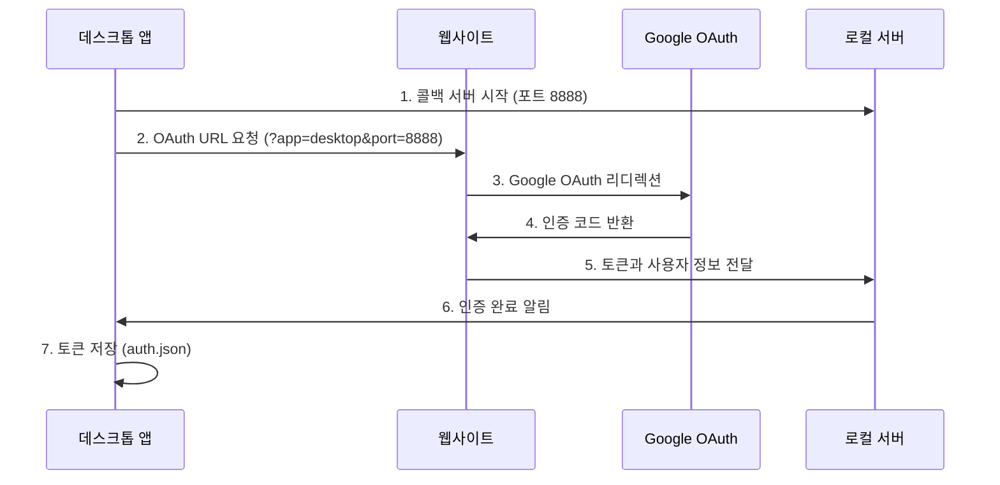
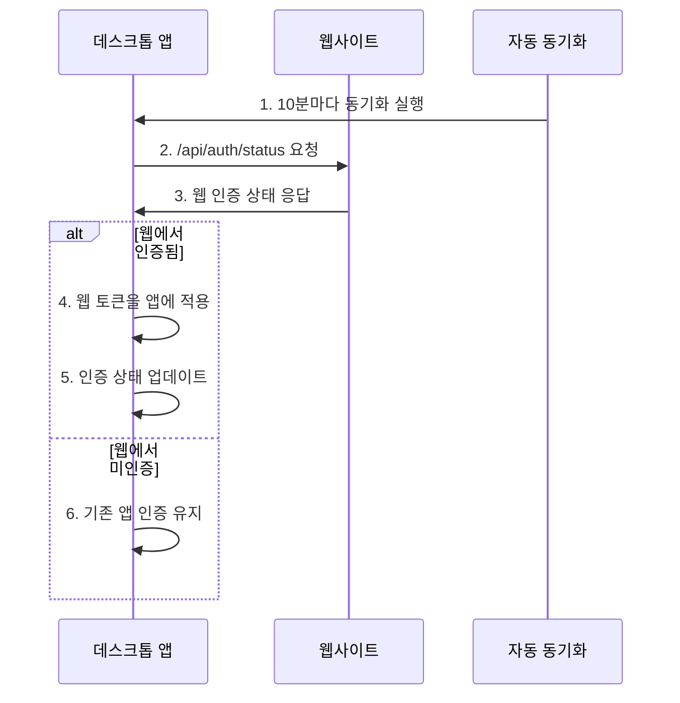

# 🔐 Google OAuth 통합 인증 시스템 설계

## 📊 개요

Think-Habit 프로젝트의 **웹사이트**와 **데스크톱 앱** 간 Google OAuth 통합 인증 시스템입니다.

기존 웹사이트의 Google OAuth 인프라를 활용하여, 데스크톱 앱에서도 동일한 인증 시스템을 사용할 수 있도록 설계되었습니다.

## 🏗️ 아키텍처

```
┌─────────────────┐    ┌─────────────────┐    ┌─────────────────┐
│   데스크톱 앱    │◄──►│   웹사이트      │◄──►│   Google OAuth  │
│   (Electron)    │    │   (Next.js)     │    │   서비스        │
└─────────────────┘    └─────────────────┘    └─────────────────┘
        │                       │
        ▼                       ▼
┌─────────────────┐    ┌─────────────────┐
│ 로컬 토큰 저장   │    │ 웹 세션 관리     │
│ (auth.json)     │    │ (쿠키/세션)     │
└─────────────────┘    └─────────────────┘
```

## 🔧 구현된 컴포넌트

### 1️⃣ **ElectronAuthService** (`src/services/ElectronAuthService.ts`)
- Electron 앱용 Google OAuth 인증 서비스
- 브라우저 창을 통한 OAuth 플로우 처리
- 로컬 콜백 서버 (포트 8888) 운영
- 토큰 저장/관리 (앱 데이터 디렉토리)

**주요 기능:**
- `signInWithGoogle()`: Google OAuth 로그인 시작
- `getStoredAuthData()`: 저장된 인증 데이터 조회
- `signOut()`: 로그아웃 및 토큰 삭제
- `isAuthenticated()`: 인증 상태 확인

### 2️⃣ **UnifiedAuthManager** (`src/services/UnifiedAuthManager.ts`)
- 웹과 앱 간 통합 인증 관리 서비스
- 자동 동기화 시스템 (10분 간격)
- 양방향 인증 상태 동기화

**주요 기능:**
- `initialize()`: 통합 인증 시스템 초기화
- `syncFromWeb()`: 웹 → 앱 인증 동기화
- `syncToWeb()`: 앱 → 웹 인증 동기화
- `signInWithGoogle()`: 통합 Google 로그인

### 3️⃣ **수정된 useAuth 훅** (`src/hooks/useAuth.ts`)
- 통합 인증 시스템을 사용하는 React 훅
- 기존 인터페이스 유지하면서 내부 구현 변경

**새로운 기능:**
- `loginWithGoogle()`: Google OAuth 로그인
- `syncWithWeb()`: 웹과 수동 동기화
- `authSource`: 인증 출처 정보 (`app` | `web` | `synced`)

### 4️⃣ **웹사이트 OAuth 확장**
- **DirectGoogleLogin 컴포넌트**: 데스크톱 앱 감지 및 콜백 처리
- **Google 콜백 API**: 앱/웹 분기 처리 및 토큰 교환

## 🔄 인증 플로우

### Google OAuth 로그인 과정



### 웹-앱 간 동기화 과정



## 📁 파일 구조

```
think-habit-journal-app/
├── src/
│   ├── services/
│   │   ├── ElectronAuthService.ts      # Electron OAuth 서비스
│   │   ├── UnifiedAuthManager.ts       # 통합 인증 관리자
│   │   └── SafeImageUploadService.ts   # 보안 이미지 업로드
│   ├── hooks/
│   │   └── useAuth.ts                  # 통합 인증 React 훅
│   └── components/
│       └── WebsiteSync.tsx             # 웹사이트 동기화 UI

웹사이트 (think-habit-project2)/
├── src/
│   ├── components/auth/
│   │   └── DirectGoogleLogin.tsx       # 데스크톱 앱 지원 OAuth
│   └── app/api/auth/google/callback/
│       └── route.ts                    # 앱/웹 분기 콜백 처리
```

## 🔐 보안 고려사항

### 1️⃣ **토큰 저장**
- **앱**: Electron의 `app.getPath('userData')` 사용
- **암호화**: 파일 시스템 권한으로 보호
- **만료**: 24시간 후 자동 만료

### 2️⃣ **네트워크 보안**
- **HTTPS**: 웹사이트와의 모든 통신 암호화
- **로컬 서버**: 127.0.0.1로 제한, 임시 포트 사용
- **CORS**: 적절한 출처 제한

### 3️⃣ **인증 검증**
- **토큰 검증**: 웹 API를 통한 토큰 유효성 확인
- **사용자 확인**: Google 사용자 정보와 로컬 저장 정보 일치 검증

## 🚀 사용법

### 1️⃣ **데스크톱 앱에서 Google 로그인**

```typescript
import { useAuth } from '../hooks/useAuth';

function LoginComponent() {
  const { loginWithGoogle, loading, error } = useAuth();

  const handleGoogleLogin = async () => {
    const result = await loginWithGoogle();
    if (result.success) {
      console.log('로그인 성공!');
    } else {
      console.error('로그인 실패:', result.error);
    }
  };

  return (
    <button onClick={handleGoogleLogin} disabled={loading}>
      {loading ? '로그인 중...' : 'Google로 로그인'}
    </button>
  );
}
```

### 2️⃣ **웹과 수동 동기화**

```typescript
const { syncWithWeb } = useAuth();

const handleSync = async () => {
  const result = await syncWithWeb();
  if (result.success) {
    alert(result.message);
  }
};
```

### 3️⃣ **인증 상태 확인**

```typescript
const { isAuthenticated, user, authSource } = useAuth();

console.log('인증됨:', isAuthenticated);
console.log('사용자:', user?.name);
console.log('인증 출처:', authSource); // 'app' | 'web' | 'synced'
```

## 🛠️ 설정

### 환경 변수 (웹사이트)
```env
NEXT_PUBLIC_GOOGLE_CLIENT_ID=your_google_client_id
GOOGLE_CLIENT_SECRET=your_google_client_secret
NEXT_PUBLIC_APP_URL=http://localhost:3000
```

### 개발 환경 설정

1. **웹사이트 서버 실행**
   ```bash
   cd think-habit-project2
   npm run dev
   ```

2. **데스크톱 앱 실행**
   ```bash
   cd think-habit-journal-app
   npm install
   npm run dev
   ```

## 🔧 문제 해결

### Google OAuth 에러
- **Client ID 확인**: 웹사이트의 환경 변수 설정 확인
- **리디렉션 URI**: Google Console에서 콜백 URL 등록 확인
- **포트 충돌**: 8888 포트가 사용 중인 경우 다른 포트 사용

### 동기화 실패
- **웹사이트 연결**: `http://localhost:3000` 접근 가능한지 확인
- **CORS 설정**: 웹사이트에서 데스크톱 앱 요청 허용 확인
- **토큰 만료**: 24시간 후 자동 만료, 재로그인 필요

## 📋 TODO

- [ ] **실제 Google OAuth API 연동** (현재 Mock 구현)
- [ ] **토큰 갱신 시스템** 구현
- [ ] **오프라인 모드** 지원
- [ ] **다중 계정** 지원
- [ ] **로그인 기록** 및 보안 로그

## 🎯 결론

이 통합 인증 시스템을 통해:

1. **일관된 사용자 경험**: 웹과 앱에서 동일한 계정 사용
2. **자동 동기화**: 한 곳에서 로그인하면 다른 곳에서도 자동 인증
3. **보안 강화**: 토큰 기반 인증 및 적절한 만료 정책
4. **유지보수성**: 중앙집중식 인증 로직으로 관리 용이

**현재 상태**: 기본 구조 완성, Google OAuth API 연동 대기 중